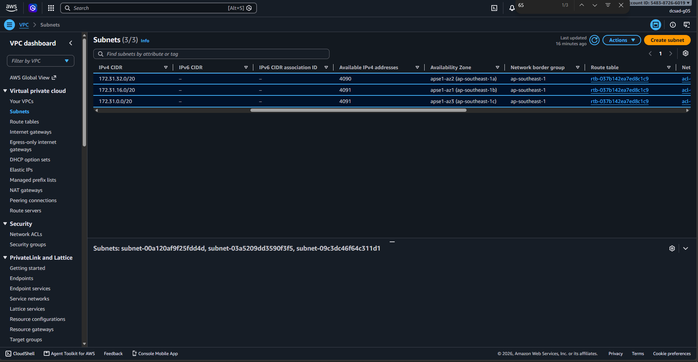
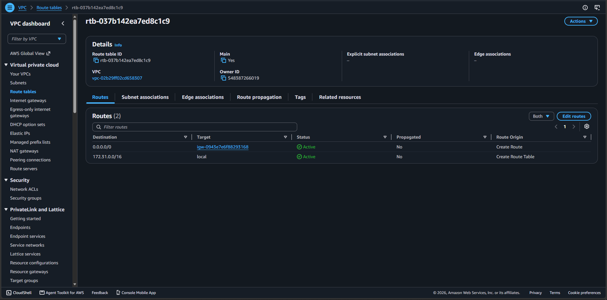
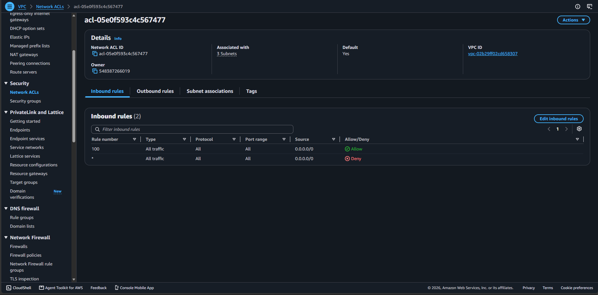
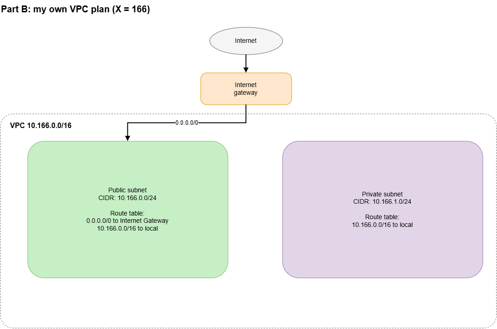

# Assignment 2 Submission

## About me

- GitHub username: scaoile
- Section: IV-DCSAD
- IAM user name that I signed in with: dcsad-g05
- X: 166

---

## Part A. Explore

### A1. The VPC

Default VPC IPv4 CIDR:

172.31.0.0/16

Number of addresses in that CIDR:

65,536

### A2. The subnets

| Availability Zone             | IPv4 CIDR        |
| ----------------------------- | ---------------- |
| `apse1-az2 (ap-southeast-1a)` | `172.31.32.0/20` |
| `apse1-az1 (ap-southeast-1b)` | `172.31.16.0/20` |
| `apse1-az3 (ap-southeast-1c)` | `172.31.0.0/20`  |

Screenshot 1. Save it as `screenshot-1-subnets.png` in your folder. The image line below shows it.

### A3. Available addresses

Available IPv4 addresses in each subnet:

4090, 4091, 4091

Why is the number lower than 4,096?

A `/20` block has 4,096 addresses, but AWS reserves 5 of them in every subnet. The first four (the network address, the VPC router, the AWS DNS server, and one kept for future use) and the last one (the broadcast address). An instance cannot use those, so an empty subnet shows 4,096 − 5 = 4,091 available addresses.

What uses the missing address in the subnet with the lowest number?

`172.31.32.0/20` (`apse1-az2 (ap-southeast-1a)`) shows 4,090, one address fewer than the other two subnets. That one address is held by a network interface, and each network interface takes one address from its subnet. In this default VPC the interface belongs to an EC2 instance, which sits in that subnet. A network interface keeps its address even when the instance is stopped, so a stopped instance still uses one address.

### A4. The route table

| Destination     | Target    |
| --------------- | --------- |
| `0.0.0.0/0`     | `igw-...` |
| `172.31.0.0/16` | `local`   |

Screenshot 2. Save it as `screenshot-2-routes.png` in your folder. The image line below shows it.

### A5. Public or private

Are the default subnets public or private? Which route proves it?

It is Public. The route `0.0.0.0/0` with target `igw-...` in the route table `rtb-037b142ea7ed8c1c9` proves it. That destination matches every address, so all traffic that no other route matches goes to the internet gateway. That is the path to the internet, which is what makes a subnet public. This is why the Lab 2 instance had a public IPv4 address and its web page opened from my laptop. The route `172.31.0.0/16` to `local` is not the proof, because a local route exists in every route table and only reaches the other subnets inside the VPC.

### A6. The internet gateway

State of the internet gateway:

Attached

What happens to the default subnets if the gateway is detached?

The route `0.0.0.0/0` loses its working target, so the subnets lose their path to the internet while their instances can still reach each other through the `local` route.

### A7. NAT gateways

Number of NAT gateways:

0

Can a server in a new private subnet download updates? Why?

No, because a new private subnet uses a route table with only the `172.31.0.0/16` local route and this VPC has no NAT gateway, so nothing can forward its traffic to the internet.

### A8. The network ACL

| Rule number | Source      | Allow or Deny |
| ----------- | ----------- | ------------- |
| `100`       | `0.0.0.0/0` | `Allow`       |
| `*`         | `0.0.0.0/0` | `Deny`        |

How is a network ACL different from a security group?

A network ACL attaches to a whole subnet, is stateless so reply traffic needs its own outbound rule, and can allow or deny traffic, while a security group attaches to one resource and keeps only allow rules.

Screenshot 3. Save it as `screenshot-3-network-acl.png` in your folder. The image line below shows it.

### A9. The default security group

Inbound rule (type and source):

Type: All traffic
Source: sg-0c5b6d4081cf0a534

Which resources can send traffic to an instance that uses it?

Only resources that use the same security group `sg-0c5b6d4081cf0a534`, because the rule allows all traffic only from that group.

---

## Part B. Prepare

### B1. Plan two subnets

- Public subnet CIDR: `10.166.0.0/24`
- Private subnet CIDR: `10.166.1.0/24`

### B2. Route tables

Route table of the public subnet:

| Destination     | Target             |
| --------------- | ------------------ |
| `10.166.0.0/16` | `local`            |
| `0.0.0.0/0`     | `internet gateway` |

Route table of the private subnet:

| Destination     | Target  |
| --------------- | ------- |
| `10.166.0.0/16` | `local` |

### B3. My VPC diagram

Tool used (Excalidraw, draw.io, Lucidchart, or paper):

draw.io

Save your diagram as `vpc-diagram.png` in your folder. The image line below shows it.

### B4. Predict a change

Can you still open the web page from your laptop? Why?

No, because my laptop is on the internet and without the route `0.0.0.0/0` that traffic has no route at all, and a public IPv4 address alone is not enough.

Can the instance still reach another instance in the VPC? Why?

Yes, because the route `172.31.0.0/16` to `local` still exists, so the instance can reach every other subnet inside the VPC.

### B5. Place a database

Which subnet gets the database? Why?

The private subnet `10.166.1.0/24`, because its route table has no route to the internet gateway, so nothing on the internet can reach the database.

### B6. My question about VPCs

What is your question, and what made you think of it?

If a subnet has a route `0.0.0.0/0` to the internet gateway, is it always public, or does an instance still need a public IPv4 address to be reachable from my laptop? A3 showed that every subnet already has 5 addresses taken and A5 showed the default route table sends everything to the internet gateway, I wondered whether the subnets are public by themselves or if each instance also needs its own public address.
